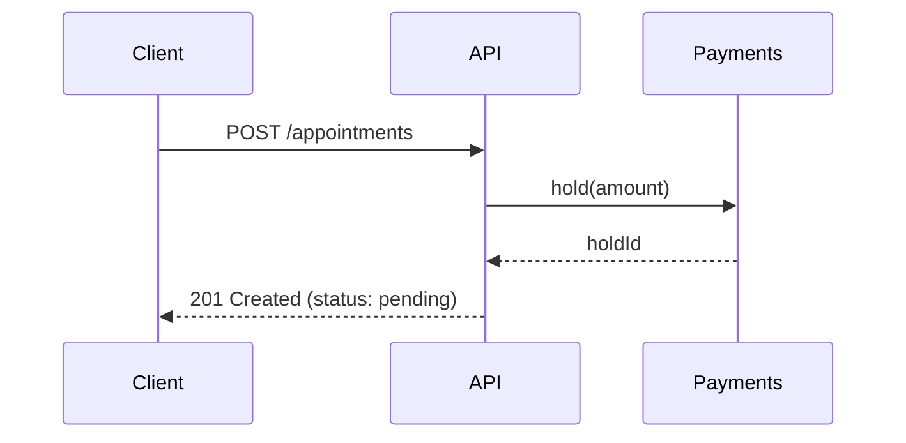

# README Files & Documenting Your Style Guide — Engineer's Handbook

> **Audience:** backend engineers on the bootcamp projects (`online-exam/team-*`, DOCURA)
> **Read time:** ~35 minutes · use Part 8 as copy-paste templates
> **Companions:** [`git-github-guide.md`](./git-github-guide.md) — the workflow around the code ·
> [`standards/README.md`](./standards/README.md) — an example of a real style guide, the one your
> code is reviewed against

---

## What this document is for

Two different jobs, one document, because they are the same skill:

1. **Writing a README** that gets a stranger from `git clone` to a running application without
   them asking you a single question.
2. **Designing and documenting the coding style guide** for your repository — deciding what is a
   rule, where the rules live, and how they are written so people actually follow them.

Both are exercises in writing for someone who does not have the context you have.

**Contents**

| Part | Topic |
| --- | --- |
| 1 | Why the README is the most-read file you will write |
| 2 | Anatomy — what goes in a README, section by section |
| 3 | The quick start: the five minutes that decide everything |
| 4 | Documenting configuration, scripts, structure, API, tests |
| 5 | Keeping documentation true over time |
| 6 | Markdown craft — formatting that helps the reader |
| 7 | **Designing and documenting the coding style guide** |
| 8 | Templates |
| 9 | Checklists, common mistakes, exercises |

---

# Part 1 — Why the README is the most-read file you will write

## 1.1 It is the landing page

GitHub renders `README.md` on the repository's front page. It is the first thing a new teammate,
a reviewer, an interviewer looking at your portfolio, and you-in-four-months all see.

Every one of them is trying to answer four questions, in this order:

| # | Question | If unanswered, they… |
| --- | --- | --- |
| 1 | **What is this?** | Close the tab |
| 2 | **Why does it exist?** | Cannot judge whether to use or contribute |
| 3 | **How do I run it?** | Ask you on Slack, or give up |
| 4 | **Where do I go next?** | Read source code to find out what you already knew |

Anything in your README that does not serve one of those four questions is competing with the
parts that do.

## 1.2 Write for the newcomer's first hour

The hardest part of documentation is forgetting what you know. You know that `MONGO_URI` has to
point at a database that already exists. You know `npm run dev` and not `npm start`. You know the
seed script must run before the tests.

The reader knows none of it, and every gap costs them a round-trip through you. Documentation is
how you stop being a bottleneck.

## 1.3 A README that lies is worse than no README

This is the one to take seriously. If there is no README, the reader is careful. If there *is*
one, they trust it — so a stale command sends them debugging a problem that does not exist, and
they lose twenty minutes before suspecting the document.

**Every command must be copy-pasteable and true today.** That one requirement generates most of
Part 5.

## 1.4 The README is an index, not an encyclopedia

Depth belongs in `docs/`. The README summarises and links.

```markdown
Bad — the entire style guide pasted into the README
## Coding style
(400 lines of naming rules, function-size rules, error-handling rules…)

Good
## Coding style
TypeScript, strict mode. Prettier owns formatting (`npm run format`); ESLint owns
correctness rules (`npm run lint`). Architecture and naming rules are in
[`docs/standards/clean-code.md`](./docs/standards/clean-code.md).
Read [`CONTRIBUTING.md`](./CONTRIBUTING.md) before your first pull request.
```

Duplicated documentation always drifts, and when two documents disagree the reader has no way to
know which one is current. Keep exactly one authoritative home per topic, and link to it.

---

# Part 2 — Anatomy: what goes in a README

## 2.1 The sections, in order

This is the recommended order — it matches the order of the four questions. "Required" means: a
repository another human will clone should not ship without it.

| # | Section | Required? | Answers |
| --- | --- | --- | --- |
| 1 | Title + one-line description | **Required** | What is this? |
| 2 | Status badges | Optional | Is it healthy? |
| 3 | Why it exists / the problem | **Required** | Should I care? |
| 4 | Features / capabilities | Recommended | What can it do? |
| 5 | Tech stack | Recommended | What am I getting into? |
| 6 | Quick start | **Required** | How do I run it in five minutes? |
| 7 | Prerequisites | **Required** | What must exist first? |
| 8 | Configuration / env variables | **Required** if any | What do I set? |
| 9 | Available scripts | Recommended | What commands exist? |
| 10 | Project structure | Recommended | Where does code live? |
| 11 | Architecture overview | Recommended | How does it fit together? |
| 12 | API reference (or a link) | **Required** for services | How do I call it? |
| 13 | Testing | **Required** | How do I verify a change? |
| 14 | Coding style (summary + link) | **Required** | How do I write code here? |
| 15 | Contributing / workflow (link) | **Required** | How do I ship a change? |
| 16 | Troubleshooting / FAQ | Optional | Why is it broken on my machine? |
| 17 | Roadmap / status | Optional | Is this finished? |
| 18 | License, authors, support | **Required** for public repos | What may I do with it? |

Sub-packages need their own README too — in a monorepo, people arrive at a directory through
search, not through the root. One screen of orientation and a link back up is enough.

## 2.2 Title and one-line description

The single most-skipped, highest-value line in the file.

```markdown
Bad
# docura

## Installation

Good
# DOCURA

Doctor booking API — appointment scheduling, payments and cancellation policy,
built as an event-driven NestJS service.
```

One sentence, naming **the domain** and **the shape of the thing** (API, CLI, library, service,
worker). A reader should be able to decide in five seconds whether this repository is relevant to them.

## 2.3 Why it exists

Two or three sentences on the problem and what breaks without this project. Not marketing —
mechanics.

```markdown
Bad:  A blazingly fast, robust, enterprise-grade, best-in-class booking platform.

Good: Clinics were double-booking slots because scheduling lived in the front end.
      This service owns slot availability and holds a slot for 10 minutes while
      payment completes, so two patients cannot pay for the same appointment.
```

**Claims are numbers, constraints, or behaviours.** Adjectives without measurements are noise, and
experienced readers discount them automatically — which means they discount your real claims too.

## 2.4 Features and tech stack

Features: a short bulleted list of capabilities in user terms, not module names. Stack: one line.

```markdown
## Tech stack
Node 20 · TypeScript (strict) · Express · MongoDB/Mongoose · Jest
```

A reader scanning for "do I know this stack?" should not have to open `package.json`.

## 2.5 What to leave out

- **Placeholders.** `TODO`, `Coming soon`, `lorem ipsum`, `<your-name-here>`. Delete the section
  instead — an empty section is a promise you are visibly not keeping.
- **Aspirational features.** If it does not exist, it goes under `## Roadmap`, explicitly, so
  nobody mistakes intent for fact.
- **Internal jargon.** Sprint names, ticket numbers, team-private acronyms. If a domain term is
  unavoidable (`attempt`, `slot`, `hold`, `grader`), define it on first use or add a short glossary.
- **Decoration.** Emoji headers, ASCII banners, badge rows that link nowhere, whole paragraphs in
  bold. They push the first real sentence below the fold.

---

# Part 3 — The quick start: the five minutes that decide everything

## 3.1 An unbroken line of commands

The quick start is not prose with commands in it. It is **one block of commands, from clone to
running**, with nothing in between that the reader has to interpret.

````markdown
## Quick start

```bash
git clone https://github.com/org/docura.git
cd docura
cp .env.example .env          # fill MONGO_URI and JWT_SECRET
npm ci
npm run db:seed
npm run dev                   # http://localhost:3000
```

Verify: `curl http://localhost:3000/health` returns `{"status":"ok"}`.
````

Explanation goes *after* the block, not inside it. A reader who just wants it running should be
able to select the whole block, paste it, and go.

## 3.2 Always include a verification step

`npm run dev` printing nothing is ambiguous — did it work? The `curl` line converts "I think it
started" into "it works", and it gives the reader something concrete to report when it does not.

## 3.3 Prerequisites, with versions

"Install Node" is not a prerequisite. Versions are.

```markdown
## Prerequisites

| Tool | Version | Notes |
| --- | --- | --- |
| Node.js | >= 20.11 (LTS) | `.nvmrc` provided — run `nvm use` |
| npm | >= 10 | Use `npm ci`, not `npm install`, for reproducible installs |
| MongoDB | 7.x | Local install, or `docker compose up -d mongo` |
```

Most "it works on my machine" incidents are an unstated version. Writing the table is cheaper than
debugging one of them.

---

# Part 4 — Documenting configuration, scripts, structure, API, tests

## 4.1 Environment variables

Every variable your code reads gets a row. Missing rows are the most common cause of a failed
first run.

```markdown
## Configuration

| Variable | Required | Default | Description |
| --- | --- | --- | --- |
| `PORT` | no | `3000` | HTTP port |
| `MONGO_URI` | **yes** | — | Connection string; the database must already exist |
| `JWT_SECRET` | **yes** | — | HS256 signing key, minimum 32 characters |
| `JWT_EXPIRES_IN` | no | `15m` | Access-token lifetime |

Never commit a real `.env` — see the secrets section of the
[git handbook](./git-github-guide.md#101-a-committed-secret-is-a-leaked-secret).
```

Pair it with a committed `.env.example` containing every key and **no real values**. The table
explains; the file is executable documentation.

**The habit that matters:** the table, `.env.example`, and the code that reads the variable all
change in the *same pull request*. Any other arrangement produces a README that is wrong within a week.

## 4.2 Scripts

If `package.json` exposes it, the README explains it.

```markdown
## Scripts

| Command | Does |
| --- | --- |
| `npm run dev` | Start with hot reload |
| `npm run build` | Compile TypeScript to `dist/` |
| `npm test` | Unit tests |
| `npm run test:watch` | Unit tests, watch mode |
| `npm run lint` | ESLint; fails on warnings |
| `npm run format` | Prettier; writes in place |
```

## 4.3 Project structure

Show the tree, and **annotate it with responsibility** — not with a restatement of the filename.
This is where your layering rules become visible to a newcomer, before they have read the style guide.

````markdown
## Project structure

```text
src/
  modules/<feature>/           one folder per feature; no cross-module imports
    <feature>.controller.ts    HTTP in/out only — no business rules
    <feature>.service.ts       business rules — no Express, no Mongoose
    <feature>.repository.ts    data access — the only file that knows the DB
    <feature>.routes.ts        route table
    <feature>.validation.ts    request schemas
  shared/                      cross-cutting utilities, errors, middleware
  config/                      env parsing and app bootstrap
```
````

Compare the useless version: `quiz.service.ts — the quiz service`. Says nothing. The annotation
above tells the reader where their new code goes *and* what it may not import.

## 4.4 API surface

For any HTTP service, a reader needs to know what they can call without reading the route files.

````markdown
## API

Full reference: [`docs/api.md`](./docs/api.md) · Swagger UI at `/docs` in development.

| Method | Path | Auth | Purpose |
| --- | --- | --- | --- |
| `POST` | `/api/v1/auth/login` | — | Issue access + refresh tokens |
| `GET` | `/api/v1/quizzes` | Bearer | List published quizzes |
| `POST` | `/api/v1/quizzes/:id/attempts` | Bearer | Start an attempt |

Response envelope:

```jsonc
{ "success": true,  "data": { } }
{ "success": false, "error": { "code": "EXPIRED_TIMER", "message": "…" } }
```
````

If the full reference is generated (OpenAPI/Swagger), link it and keep only the summary table here.

## 4.5 Testing

````markdown
## Testing

```bash
npm test                  # unit tests
npm run test:coverage     # unit tests + coverage report
npm run test:e2e          # integration tests; requires a running MongoDB
```

Unit tests mock all I/O. Integration tests run against a disposable database via
`supertest`. Every bug fix ships with a test that fails without the fix.
````

A contributor who cannot run the tests cannot verify their change — so they will not write one.
Two commands and two sentences remove that excuse.

## 4.6 Troubleshooting

The rule is simple: **the second time someone asks a setup question, it becomes a Troubleshooting
entry.** That is the whole process. Knowledge that only exists in chat gets re-derived by every
new person.

---

# Part 5 — Keeping documentation true over time

Documentation does not rot because people are lazy. It rots because the code changed and nothing
forced the document to change with it. These four practices are the forcing functions.

## 5.1 The same-PR rule

**Documentation changes ship in the same pull request as the code that invalidates them.**

A follow-up "docs" ticket is not a plan, it is a documentation debt with an optimistic label.
Renamed a script, added an env var, changed a route, moved a folder? The README change is part of
that PR, and a reviewer should treat its absence as blocking.

Make it mechanical — add a line to your PR template:

```markdown
## Docs
- [ ] README / `.env.example` / API reference / style guide updated, or not affected
```

## 5.2 The clean-clone test

Before merging any change to setup, follow your own quick start on a fresh clone with an empty
`node_modules`. Time it.

If it takes more than five minutes, the answer is usually to fix the *setup* — add a
`docker compose` file, a seed script, a `postinstall` — not to write more prose explaining the
friction.

## 5.3 The newcomer as reviewer

The next person to join the team reviews the README as their first task. Their confusion is the
highest-signal bug report the document will ever receive, and it is only available once —
after a week they will have absorbed all the missing context and stopped noticing the gaps.

## 5.4 Delete aggressively

The best README edit is usually a deletion. Sections about removed features, migration notes for a
version nobody runs, "currently we only support X" from two years ago — all of it costs the reader
attention and costs you credibility.

Git keeps the history. The README keeps the present.

And when you must make a time-bound claim, write the absolute date:

```markdown
Bad:  Currently only MongoDB is supported.
Good: As of 2026-09, only MongoDB is supported.
```

"Currently" never expires, so nobody ever revisits it.

---

# Part 6 — Markdown craft

Small things, but they are the difference between a document people read and one they skim.

## 6.1 Headings

One `#` per document. Never skip a level (`##` then `####`). GitHub's outline sidebar, in-page
anchors, and screen readers all depend on the hierarchy being real.

## 6.2 Code fences: always tag the language

```` ```bash ````, ```` ```ts ````, ```` ```json ````, ```` ```text ````. Without the tag you lose
syntax highlighting, and the reader cannot tell a shell command from source code at a glance.

And keep shell blocks pasteable — no prompts, no output:

```bash
# Bad — cannot be copy-pasted
$ npm ci
added 412 packages in 9s

# Good
npm ci
```

## 6.3 Links: relative, always

```markdown
Bad:  https://github.com/org/repo/blob/main/src/app.ts
Good: ./src/app.ts
```

Relative links survive forks and renames, work offline and in editors, and are greppable —
`grep -o '](\./[^)]*)'` over your docs finds every internal link so you can check them.

## 6.4 Tables for facts, lists for sequences, prose for reasoning

Enumerable things — variables, endpoints, scripts, versions, options — go in tables. Anything with
an order goes in a numbered list. Prose is for explaining *why*, which is the one thing a table
cannot do.

A wall of prose describing eight environment variables is the most common README formatting mistake.

## 6.5 A picture, when it earns its place

A UI project with no screenshot, or an event-driven system with no flow diagram, is making the
reader build the picture in their head from prose.

Prefer Mermaid over an image file: GitHub renders it natively, it diffs as text, and it cannot
go stale in a binary nobody can edit.

````markdown

````

For real images, always write alt text. It is what screen readers announce and what shows when the
image 404s.

## 6.6 Length

If a document passes ~150 lines, add a table of contents or rely on GitHub's outline button. If it
is long because it covers several topics, split it instead — one topic per file, linked from the
README.

---

# Part 7 — Designing and documenting the coding style guide

This is the part that outlives the project. A style guide is how a team's accumulated judgement
becomes reusable instead of being re-argued in every pull request.

## 7.1 Where the rules live

The most common failure is not a bad rule. It is rules that exist only in review comments, in
chat, or in one senior engineer's memory — so they are applied inconsistently, and new people
discover them by being corrected.

Give every kind of rule exactly one home:

| Document | Contains | Read by |
| --- | --- | --- |
| `README.md` | 3–6 line summary + links | Everyone, once |
| `CONTRIBUTING.md` | Workflow: branching, commits, PRs, review, local setup | Before the first PR |
| `docs/standards/*.md` | The rules themselves, with examples | Reviewers, and authors when a rule is cited |
| Tool configs (`.prettierrc`, `eslint.config.js`, `tsconfig.json`, `.editorconfig`) | The machine-enforced subset | Nobody — they just run |

**Exactly one document is authoritative per rule.** Everything else links to it. Two documents
that both describe your naming convention will disagree within a month, and then neither can be trusted.

Keep all of it **in the repository**, not in a wiki or a slide deck. Documentation inside the repo
can be reviewed in a pull request, diffed, and pinned to the commit it described. Documentation
outside the repo cannot, which is why wikis are always out of date.

## 7.2 Automate first — then write down what is left

Work in this order, because each step shrinks the next:

1. **Configure the tools.** `.editorconfig`, Prettier, ESLint, `tsconfig` strict flags, a
   `commit-msg` hook.
2. **Whatever survives automation is what the document must cover.**

A rule a human has to remember is a rule that will be violated and then debated. Move it into a
config file and it stops being a conversation.

```markdown
Bad — a style guide section that a tool should own
## Style
- Use 2 spaces for indentation
- Always use single quotes
- Put a semicolon at the end of every statement
- Order imports: node builtins, then packages, then local

Good
## Formatting
Prettier owns all formatting; the config **is** the rule ([`.prettierrc`](./.prettierrc)).
Do not discuss formatting in review — run `npm run format`.
Import order is enforced by `eslint-plugin-import` (`import/order`).
```

"Do not discuss formatting in review" is the real win. Formatting arguments are pure cost: both
positions are fine, and the discussion produces nothing.

## 7.3 What stays in prose

Tools cannot check intent or structure. That is exactly what your written guide is for — and it is
the valuable half:

- **Naming intent** — a linter can enforce `camelCase`; it cannot tell you that `data` is a
  useless name where `attempt` was available.
- **Layering and the dependency rule** — which layer may import which; what must never reach the domain.
- **Abstraction boundaries** — when to extract a module, when a "helper" is really a missing concept.
- **Error-handling policy** — which error types exist, how they cross layers, what the HTTP boundary
  turns them into.
- **Async and concurrency rules** — transactions, idempotency, what must be atomic.
- **When to add a dependency**, and how that gets justified.

Notice that syntax rules — the cheapest to fix and the easiest to automate — are the *least*
valuable thing a style guide can contain. The expensive, hard-to-reverse decisions are structural.

## 7.4 Anatomy of a rule that works

A rule needs five things. Drop any one and people stop following it.

### 1. A stable identifier

Give every rule an ID, grouped into numbered bands (`CC-0xx` naming, `CC-1xx` functions,
`CC-2xx` architecture…). An ID makes a review comment short, searchable, linkable, and comparable
across teams and over time:

```text
Without IDs:  "see the style guide, the part about layering, near the middle"
With IDs:     "blocking: CC-201 — this belongs in the service, not the controller"
```

This is how the catalogs in [`standards/`](./standards/) are built, and it is the single change
that most improves whether a guide gets used.

### 2. A severity, tied to a merge decision

If every rule reads as equally mandatory, reviewers block merges over naming preferences and
people start ignoring the whole document.

| Severity | Meaning | Merge policy |
| --- | --- | --- |
| `critical` | Wrong behaviour, security hole, data loss, silent failure | Block. Fix before merge. |
| `major` | Maintainability or correctness risk: broken layering, untyped boundaries, tests that cannot fail | Block unless the author writes down an accepted-debt note |
| `minor` | Style, naming, local clarity. No behaviour risk | Batch-fix. Never blocks a merge alone |

### 3. A reason

**An unexplained rule is cargo cult.** Without the *why*, people cannot tell when the rule does
not apply — so they either follow it into a bad design or ignore it entirely. Both are worse than
having no rule.

### 4. A Bad/Good pair, in your real language and idiom

Generic pseudo-code teaches nothing. Use the smallest real violation from your own codebase and
its fix. Most people read the code and skip the prose; the example *is* the rule for them.

### 5. A stated exception

Every rule has cases where it is wrong. Say what they are, and say how to deviate on purpose so
people stop deviating silently:

```ts
// eslint-disable-next-line @typescript-eslint/no-explicit-any -- third-party
// The `mongoose.Query` generic is unsound before v9; narrowed at the call site below.
```

An escape hatch that requires naming the rule and the reason, in a line that gets reviewed like
any other, is far better than a rule people quietly route around.

### Putting it together

````markdown
### CC-201 — Business logic in the controller
**Severity:** major · **Applies to:** `src/**/*.controller.ts`
**Detect:** conditionals on domain state, calculations, or repository calls
inside a controller method.

```ts
// Bad — the rule lives in the HTTP layer
async submit(req: Request, res: Response) {
  const attempt = await AttemptModel.findById(req.params.id);
  if (Date.now() > attempt.startedAt.getTime() + attempt.duration * 60_000) {
    return res.status(409).json({ success: false, error: { code: 'EXPIRED_TIMER' } });
  }
  // …
}

// Good — the controller translates HTTP; the service owns the rule
async submit(req: Request, res: Response, next: NextFunction) {
  const result = await this.attemptService.submit(req.params.id, req.body);
  res.status(200).json({ success: true, data: result });
}
```

**Why:** rules in a controller cannot be unit-tested without Express, cannot be
reused by a job or a CLI, and get silently duplicated in the next endpoint.
**Instead:** the controller parses and validates input, calls one service method,
and shapes the response. Nothing else.
**Exception:** input shape validation (`*.validation.ts`) stays at the boundary —
it is about HTTP, not about the domain.
````

## 7.5 What a complete style guide covers

Use this as your coverage checklist. Anything unchecked is a decision your team is making
inconsistently right now.

- [ ] **Naming** — files, folders, classes, functions, booleans, constants, test names.
- [ ] **Project structure** — where a new feature goes; what a folder may contain.
- [ ] **Layering and the dependency rule** — which layer imports which; what never reaches the domain.
- [ ] **Function and module size** — the limits, and what to do when you exceed them.
- [ ] **Types** — strictness, the `any` policy, where types live, DTO vs domain model.
- [ ] **Error handling** — error classes, how errors cross layers, what the HTTP boundary does.
- [ ] **Async** — promise handling, cancellation, transactions, concurrency rules.
- [ ] **Testing** — unit vs integration, mocking policy, what must be tested.
- [ ] **API conventions** — URL shape, status codes, response envelope, versioning.
- [ ] **Comments and documentation** — when a comment is required; docstring format.
- [ ] **Dependencies** — how a new one is justified and approved.
- [ ] **Formatting** — one line: "the tool owns it", plus the config link.

Your projects already have four of these written up in
[`standards/`](./standards/) — [`clean-code.md`](./standards/clean-code.md),
[`typescript.md`](./standards/typescript.md), [`testing-jest.md`](./standards/testing-jest.md)
and [`restful-api.md`](./standards/restful-api.md). Read one of them as a worked example of
everything in 7.4.

## 7.6 How a rule changes

Write this down, in one paragraph, or the guide becomes something imposed rather than owned:

> Disagree with a rule in a review → open an issue labelled `needs-discussion` → the team decides →
> the rule changes through a pull request that edits the catalog and, where possible, the lint
> config in the same commit. **Until it changes, the written rule stands.**

That last sentence is what keeps a guide from being re-litigated in every PR, and the first part is
what keeps it from being a museum.

## 7.7 Prune it

Review the guide every few months. A rule nobody has cited in months is one of three things:

- **Automated** — delete the prose, the tool owns it now.
- **Obvious** — delete it; it is costing attention that the real rules need.
- **Wrong** — delete it, or fix it.

A style guide of 12 rules everyone knows beats one of 80 rules nobody reads.

## 7.8 Build order, if you are starting from nothing

1. Configure the tools (7.2). Formatting, lint, strict types, commit-message hook.
2. Write the **layering rule** — one table or diagram of which layer may import which. This is the
   rule that prevents the expensive mistakes.
3. Write the **naming rules**, with examples taken from your own repository.
4. Write the **error-handling policy**, end to end: error classes → how they cross layers → what
   the HTTP boundary returns → what gets logged.
5. Give every rule an ID, a severity, a reason and a Bad/Good pair (7.4).
6. State the exception mechanism and the amendment process (7.4.5, 7.6).
7. Summarise in six lines in the README and link the rest (Part 8.2).

---

# Part 8 — Templates

## 8.1 README skeleton for a backend service

Copy it, delete what does not apply, and never leave a placeholder behind.

`````markdown
# <Project Name>

<One sentence: the domain, what it is, what shape it takes.>

[badges — only if they link somewhere real]

## Why this exists
<The problem, in two or three sentences. What breaks without it.>

## Tech stack
Node 20 · TypeScript (strict) · Express · MongoDB/Mongoose · Jest

## Quick start
```bash
git clone <url> && cd <repo>
cp .env.example .env
npm ci
npm run dev
```
Verify: `curl localhost:3000/health` returns `{"status":"ok"}`.

## Prerequisites
| Tool | Version | Notes |
| --- | --- | --- |

## Configuration
| Variable | Required | Default | Description |
| --- | --- | --- | --- |

## Scripts
| Command | Does |
| --- | --- |

## Project structure
```text
src/…   <annotated with responsibility, not with filenames>
```

## API
<Endpoint table + response envelope, or a link to the full reference.>

## Testing
```bash
npm test
npm run test:coverage
```
<What is unit vs integration; what must be covered.>

## Coding style
<3–6 lines: the tools that enforce it, plus a link to the full guide.>

## Contributing
Branching, commits and review: [`CONTRIBUTING.md`](./CONTRIBUTING.md).

## Troubleshooting
<The questions that have now been asked twice.>

## License
`````

## 8.2 The "Coding style" section — the right size

Six lines. It orients and delegates:

```markdown
## Coding style

TypeScript in `strict` mode. **Prettier owns formatting** and **ESLint owns correctness
rules** — run `npm run lint` and `npm run format` before pushing, and do not debate
either in review. Rules that tools cannot check (layering, naming intent, error
handling) live in [`docs/standards/`](./docs/standards/); reviewers cite rule IDs such
as `CC-201`. To change a rule, open an issue labelled `needs-discussion` — until it
changes, the written rule stands.
```

## 8.3 Style-guide rule template

````markdown
### <ID> — <the violation, named as a problem>
**Severity:** critical | major | minor · **Applies to:** <paths>
**Detect:** <the grep, the smell, or the observable symptom>

```<lang>
// Bad
<the smallest real violation>

// Good
<the fix>
```

**Why:** <the cost this rule avoids>
**Instead:** <what to do>
**Exception:** <when the rule does not apply>
````

---

# Part 9 — Checklists, mistakes, exercises

## 9.1 Before you merge a README change

- [ ] Title has a one-line description under it.
- [ ] Quick start is one unbroken command block, with a verification step.
- [ ] Prerequisites list versions.
- [ ] Every `process.env.*` your code reads has a row in the config table **and** a line in
      `.env.example`.
- [ ] Every command in the file actually exists in `package.json`.
- [ ] Every relative link resolves.
- [ ] No `TODO`, no placeholder, no feature that does not exist.
- [ ] Every code fence has a language tag.
- [ ] You ran the quick start on a clean clone.

## 9.2 Before you call a style guide done

- [ ] Everything automatable is in a tool config, not in prose.
- [ ] Layering and the dependency rule are written down.
- [ ] Every rule has an ID, a severity, a reason, and a Bad/Good pair.
- [ ] The severity ladder says what each level does to a merge.
- [ ] The exception mechanism is documented.
- [ ] The amendment process is documented.
- [ ] It lives in the repository and changes through pull requests.
- [ ] The README links to it in six lines or fewer.

## 9.3 The mistakes that cost the most

| Mistake | What it costs | Instead |
| --- | --- | --- |
| A command in the README that no longer works | Twenty minutes of debugging a non-problem, then lost trust | Clean-clone test before merging setup changes (5.2) |
| Env variable added, docs not updated | The next person's first run fails | Same-PR rule; table + `.env.example` (4.1, 5.1) |
| Style rules only in review comments | Applied inconsistently; new people learn by being corrected | One authoritative document, with IDs (7.1, 7.4) |
| Prose rules about indentation and quotes | Recurring pointless review arguments | Let Prettier own it (7.2) |
| Rules with no reason given | Followed blindly into bad designs, or ignored | State the cost the rule avoids (7.4.3) |
| No severity on rules | Merges blocked over naming preferences | A severity ladder tied to merge policy (7.4.2) |
| Whole style guide pasted into the README | Two versions that drift; nobody knows which is current | Summary + link (1.4, 8.2) |
| Style guide in a wiki or slide deck | Cannot be reviewed, diffed, or pinned to a commit | Keep it in `docs/`, change it by PR (7.1) |
| Marketing adjectives instead of facts | Readers discount your real claims too | Numbers, constraints, behaviours (2.3) |
| "Currently we only support X" | Never revisited, wrong forever | Write the absolute date (5.4) |

## 9.4 Exercises on your own project repository

1. Hand your README to someone who has never seen the project and watch them follow the quick
   start. Do not help. Write down every question they ask — each one is a missing section.
2. Run `grep -rho 'process\.env\.[A-Z_]*' src | sort -u` and check every result appears in both
   your config table and `.env.example`.
3. Run every command in your README on a fresh clone. Count how many fail.
4. Take the three most frequent comments from your team's last ten pull requests. Write each one
   up as a proper rule using the template in 8.3 — ID, severity, reason, Bad/Good, exception.
5. For each of those three rules, ask: could a linter enforce this? If yes, configure it and delete
   the prose.
6. Read [`standards/clean-code.md`](./standards/clean-code.md) and find a rule whose *reason* you
   disagree with. Open an issue labelled `needs-discussion` and argue it. That is the process in 7.6
   working as intended.
